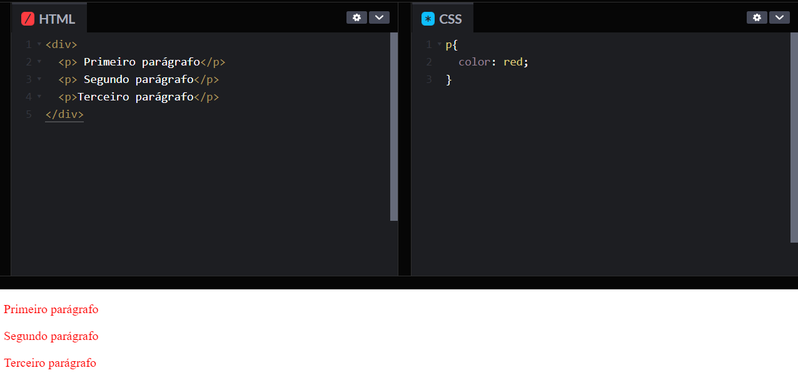
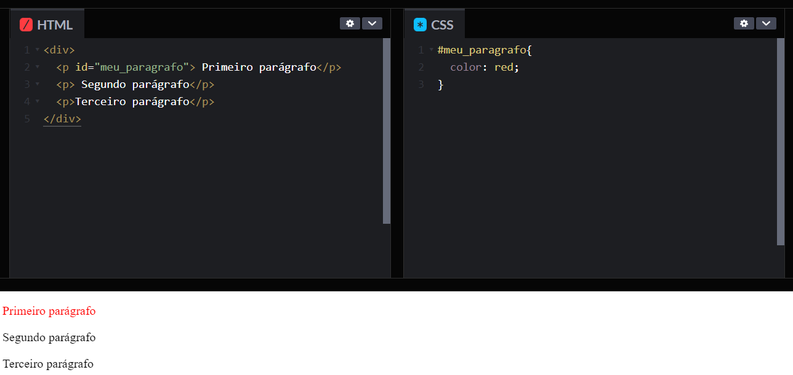
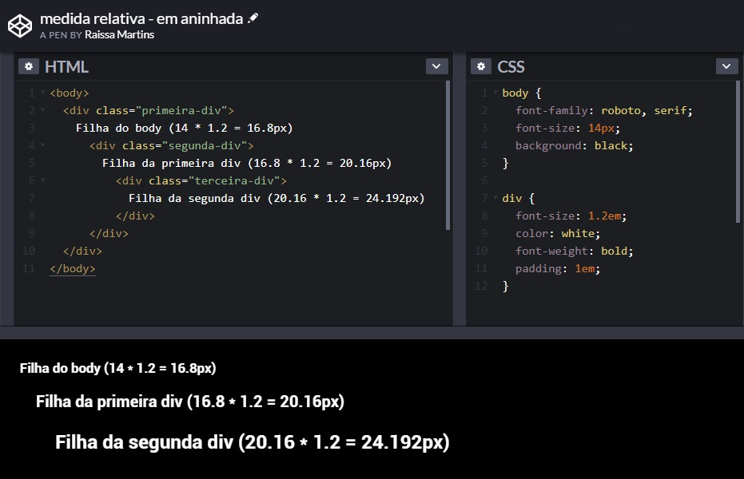
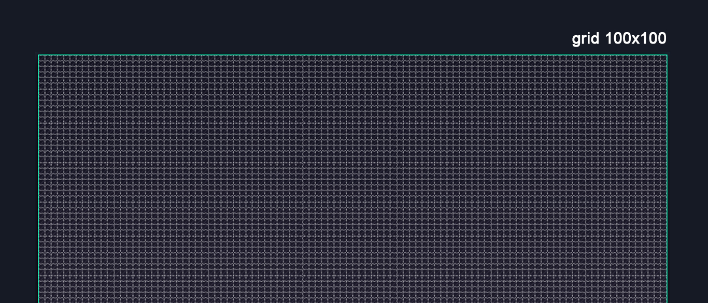
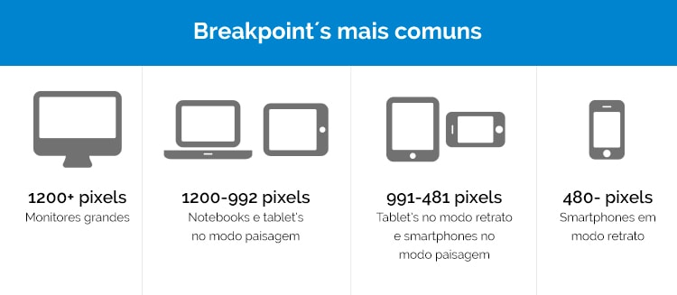

# Todas em Tech 17 - HTML e CSS-II

[link para o arquivo dontpad](http://www.dontpad.com/On17-%20Resposividade)


## Conteúdo - Aulas 16 de Abril e 20 de abril


Manhã

1 [Revisão aula anterior](#layoutResponsivo)

2 [Seletores CSS](#resolucaoTamanho)

3 [Responsividade](#layoutResponsivo)

3 [Unidades de medidas responsivas](#unidadesMedida)

4 [Imagens responsivas](#imagensResponsivas)

5 [Breakpoints & Media Queries](#breakpointsMedia)

6 [Tipos de displays](#displays)

7 [Mobile First](#mobileFirst)

Tarde 

1 Desenvolver um formulário 

2 Estilizar a página com CSS

3 Deixar a página responsiva

**[Exercício para sexta] (#exercicio)**


## Revisão

- Estrutura HTML
- CSS

## Seletores CSS

- Seletor por tag: 

Este seletor escolhe todos os elementos que correspondem ao nome da tag mencionada.

EX: 

 [](https://codepen.io/julianesas/pen/bGambvO)  
O exemplo acima irá fazer com que todas as tags parágrafos do documento fiquem em cor vermelha.

- Seletor por classe

Este seletor escolhe elementos baseados no valor de seu atributo classe. EX:
 [](https://codepen.io/julianesas/pen/yLpRBzm)  

- Seletor por ID

Este seletor escolhe nós baseados no valor do atributo id. Deve existir apenas um elemento com o mesmo ID no mesmo documento.
 [](https://codepen.io/julianesas/pen/LYegPmL)  


- Seletor por espaço

Seleciona os nós que são filhos do elemento especificado anteriormente. O filho não precisa ser direto.
[](https://codepen.io/julianesas/pen/GRyYKdG)  


- seletor *

O seletor * aplica estilos a todos os elementos do documento html.

[](https://codepen.io/julianesas/pen/OJzBRdj)  


- Seletor >

O seletor `>` selecina nós que são filhos diretos do elemento especificado anteriormente.

[](https://codepen.io/julianesas/pen/yLpRBGy)  

- Seletor +

O seletor `+` separa dois seletores e corresponde ao segundo elemento somente se ele seguir imediatamente o primeiro elemento e ambos forem filhos do mesmo pai.

EX:

[](https://codepen.io/julianesas/pen/rNpqBXW)  

- Seletor ~

O seletor `~` seleciona os nós que seguem (não necessariamente imediatamente) o elemento especificado anteriormente, se ambos os elementos compartilham o mesmo pai.

EX:

[](https://codepen.io/julianesas/pen/QWaZWrE) 

# Responsividade > conceitos

<div id='layoutResponsivo'></div>

## Layout Responsivo 

Um **layout responsivo** é aquele que se "adapta" automaticamente aos dispositivos no qual ele está sendo visualizado, e é parte fundamental do conceito de **design responsivo**, que nada mais é do que a possibilidade de **adaptação fluida** de um site a diversos tamanhos de tela.


**Tipos de dispositivos:**

* Notebooks
* Tablets
* Celulares
* Desktops  
* Televisões


**Alguns fundamentos para a construção de um layout responsivo são:**

* Redimensionar imagens automaticamente
* Simplificar e/ou ocultar elementos
* Adaptar o tamanho de botões e links para interfaces touch

---

<div id='resolucaoTamanho'></div>


## Unidades de medida responsivas


### Medidas absolutas:

Essas são as mais comuns que vemos no dia a dia. São medidas que não estão referenciadas a qualquer outra unidade, ou seja, não dependem de um valor de referência.

Essas medidas são **estáticas** não mudam de acordo com as especificações do dispositivo.

_Quais são:_ **pixels (px)**, points (pt), inches/polegadas (in), centímetro (cm), milímetro (mm) e paica (pc)

* 96px = 1 in = 2,54cm = 25,4mm = 72pt = 6pc

### Medidas relativas:

Essas são as que normalmente não estamos habituados. Essas medidas são calculadas tendo como base uma outra unidade de medida pré definida.

Devido ao fato de que essas medidas serem calculadas pelo browser baseando-se em outra unidade, elas tendem a ser bastantes **flexíveis**. Ou seja, podemos ter resultados diferentes de acordo com o tamanho de tela. 

_Quais são:_

* em

    **EM** A unidade de medida EM, está relacionada a letra M, onde o tamanho base dessa unidade deriva da largura da letra M em maiúscula.. Para entender sua aplicação, vamos utilizar o exemplo abaixo onde foi definido um tamanho de fonte no elemento `<div>`, o valor de **em** declarado em qualquer elemento-filho dentro de `<div>` será igual a: **o valor declarado no elemento-filho * o valor declarado no elemento pai**. 

    Nesse caso: **1.2(em) * 14px = 16.8px**

    [](https://codepen.io/raissamartinsmenezes/pen/BaazMzm)

    Entretanto, o que acontece quando se tem um elemento com valor **em** dentro de outro elemento com valor **em**?

    [](https://codepen.io/raissamartinsmenezes/pen/OJJXdzQ)

    [Calculadora online: px para em](http://pxtoem.com/)

* rem

    O **REM** vem como sucessor do **EM** e ambos compartilham a mesma lógica de funcionamento, porém a forma de implementação é diferente. Enquanto o em está diretamente relacionado ao tamanho da fonte do elemento mãe, o **rem** está relacionado com o tamanho da fonte do **elemento root (raiz)**. Embora sejam medidas tipográficas, **REM e EM** também podem ser utilizadas para outras finalidades, na atribuição de valores para margins e paddings por exemplo.  

    [](https://codepen.io/raissamartinsmenezes/pen/LYYRZam)

    [Calculadora online: px para rem](https://daniellamb.com/experiments/px-to-rem-calc/)

* porcentagem %

    Apesar de não ser uma unidade de medida, a porcentagem costuma ser bastante utilizada quando falamos de layout responsivo e fluido por conta de seu caráter adaptativo. 

    A porcentagem permite que criemos elementos que sempre vão se readaptar para ocupar a quantidade especificada.

    [](https://codepen.io/raissamartinsmenezes/pen/abbmJvY)

    **Note que a propriedade `width:` é relativa ao elemento-ancestral mais próximo.** 

* vh e vw

    Muitas técnicas de web design responsivo dependem muito de regras percentuais. **Mas e se fosse preciso usar a largura ou a altura da viewport ao invés da largura do elemento-pai?** Isso é exatamente o que as unidades vh e vw proporcionam.

    A medida vh é igual a **1/100** da altura da viewport. Então, por exemplo, se a altura do navegador é 900px, 1vh equivale a 9px e, analogamente, se a largura da viewport é 750px, 1vw equivale a 7.5px. Sendo assim, **1vw = 1% da largura da viewport e 1vh = 1% da altura da viewport**.

    

 

* Outras unidades de medida

    **vmax e vmin:** [UNIDADES CSS RELATIVAS: VW, VH, VMAX, VMIN (CSS3)](https://www.youtube.com/watch?v=g__c-7M9Xzk&t=94s)

    

---

<div id='imagensResponsivas'></div>

## Imagens responsivas

Imagens responsivas respondem ao tamanho da tela para escalar proporcionalmente, sem ficar pixeladas ou desproporcionais.


Uma técnica para conseguirmos ter imagens responsivas é a seguinte:

```css
.img-responsiva {
  width: 100%;
  max-width: 100%;
  height: auto;
}
```

Criamos uma classe que podemos aplicar a todas as imagens que estão no html que queremos que fiquem responsivas. As imagens que tiverem essa classe vão ter 100% de largura com altura sempre proporcinal a altura. O atributo `max-width: 100%` vai assegurar que essa imagem não estique mais do que o tamanho original dela permite.


---

<div id='breakpointsMedia'></div>

## Breakpoints e Media Queries

**Media queries** é uma técnica de consulta de mídia que atribui diferentes estilos CSS para cada resolução de tela detectada. Uma media query é um recurso do CSS3 que faz com que uma página da web se adapte ao seu layout para tamanhos de tela e tipos de mídia diferentes.

As media queries definem condições para utilização de estilos CSS. Se o dispositivo de acesso do usuário se adequar as **condições** definidas, se aplicam os estilos definidos nos elementos. 
```css
@media () {
  // regras de CSS
}
```

Existem muitos tipos de dispositivos, mas podemos agrupá-los em 4 categorias:

all —  todos os tipos de mídia

print —  impressoras

screen —  telas de computador, tablets e smartphones

speech —  leitores de tela que “leem” a página em voz alta

* Breakpoints

 Um breakpoint é uma chave (condição) para determinar o momento de mudar o layout e adaptá-lo às novas regras dentro das media queries. 

 ```css
@media (max-width: 480px) {
  // regras de CSS
}
```

Caso a tela do dispositivo tiver uma resolução de 480px, as regras css especificadas destro da caixinha da Media queries será aplicada.


**Importante:** Quando formos utilizar media queries, o primeiro passo é adicionar uma metatag chamada viewport no do site. Essa tag vai passar instruções para o browser renderizar o conteúdo do site conforme o tamanho do dispositivo.

```html
<head>
  <meta charset="utf-8">
  <meta name="viewport" content="width=device-width, initial-scale=1">
  <link href="css/style.css" rel="stylesheet">
</head>
```


**Sintaxe:**

```css
/* condição até 600px */
@media (max-width: 600px) { 
  .nome-da-classe {
    color: #fff; /* elemento que vai ser modificado/adicionado/sobrescrito nessa resolução */
  }
}
/* condição a partir de 900px */
@media (min-width: 900px) { 
  .nome-da-classe {
    color: #fff; /* elemento que vai ser modificado/adicionado/sobrescrito nessa resolução */
  }
}
/* condição a partir de 600px até 900px */
@media (min-width: 600px) and (max-width: 900px) { 
  .nome-da-classe {
    color: #fff; /* elemento que vai ser modificado/adicionado/sobrescrito nessa resolução */
  }
}
```



Vamos analisar sua aplicação no [exemplo 😊](./Exemplos/media_queries.html)

_Para saber mais:_

* [Media Queries MDN](https://developer.mozilla.org/pt-BR/docs/Web/Guide/CSS/CSS_Media_queries)
* [Mobile Test Me](http://mobiletest.me/)

---

<div id='displays'></div>

## Tipos de displays


* Block
O elemento se comporta como um bloco. Ocupando praticamente toda a largura disponível na página. Elementos de parágrafo (p) e título(h1, h2, ...) possuem esse comportamento por padrão.

* Inline
O elemento se comporta como um elemento em linha. Exemplos de elemento que se comportam assim são por exemplo as tags span e a.

* Inline-block
Semelhante ao inline, no entanto, ao definirmos inline-block em um elemento, conseguimos definir as propriedades de largura e altura para ele. Coisa que não conseguimos em um elemento com display: inline.

* Flex

Esse display vai deixar o layout das tags filhas flexiveis.

* None
Ao contrários dos valores atuais, o valor none permite, informalmente dizendo, que você desative a propriedade do elemento. Quando você utiliza essa propriedade, o elemento e todos seus elementos filhos não são renderizados na página.


Vamos entender como o flex funciona [aqui!](https://codepen.io/raissamartinsmenezes/pen/XWWNbrP)

[Guia completo de Flexbox](https://origamid.com/projetos/flexbox-guia-completo/)

Vamos praticar transformando um layout feito para desktop em responsivo 📲

## Mobile First


Mobile First é um método onde o foco do desenvolvimento de projetos web está direcionado aos dispositivos móveis. A técnica prioriza a construção da arquitetura mobile, seguida do pensamento para desktops. O conceito está cada vez mais popular no mercado da comunicação e da tecnologia.


**Vantagens:**

* Otimização do site para o celular
* Os conteúdos precisam ser disponibilizados de forma mais otimizada e não há espaço para informações irrelevantes
* Sites limpos, funcionais e visualmente agradáveis

**Desvantagem:**

* Limitação criativa do projeto


**Links úteis para realização do exercício :)**

[Como usar as fontes do google](https://www.anicasagrande.com.br/google-fonts-o-que-e-como-funciona-e-como-usar/)

[Metodologia BEM para nomeação de classes e uso no CSS](https://medium.com/@fnandaleite/metodologia-bem-para-css-b0d3269b4853)

[Aplicando opacidade na cor](https://developer.mozilla.org/pt-BR/docs/Web/CSS/opacity)

[Box-model - Entendendo como funciona elementos no HTML](https://tableless.github.io/iniciantes/manual/css/box-model.html)

[Propriedade object-fit para ajuste de imagens no CSS](https://cahfelix.com/entendendo-o-object-fit/)

[A propriedade display no CSS - block, inline e none](https://tableless.github.io/iniciantes/manual/css/display.html)

[Como usar os seletores CSS - Um guia completo](https://ayltoninacio.com.br/blog/como-usar-os-seletores-css-um-guia-completo)

[Conheça os elementos semânticos do HTML](https://www.devmedia.com.br/html-semantico-conheca-os-elementos-semanticos-da-html5/38065)

[Centralizando conteúdos com `<div>s` no HTML](https://www.devmedia.com.br/como-centralizar-divs-em-html-e-css/37568)

[CSS reset de várias maneiras](https://woliveiras.com.br/posts/css-reset-de-varias-maneiras/)

[Como utilizar a técnica CSS reset](https://www.devmedia.com.br/como-utilizar-a-tecnica-css-reset/26797)


#### Referências utilizadas para a construção deste material
* [Repositório - On13-Responsivo](https://github.com/reprograma/On3-Responsivo)
* [Repositório - On10-Responsivo](https://github.com/reprograma/On10_TodasEmTech-S4-Responsividade )
* [Tipos de display](https://www.devmedia.com.br/css3-flexbox-funcionamento-e-propriedades/29532)


 


